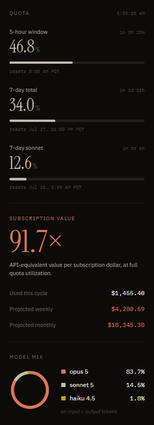
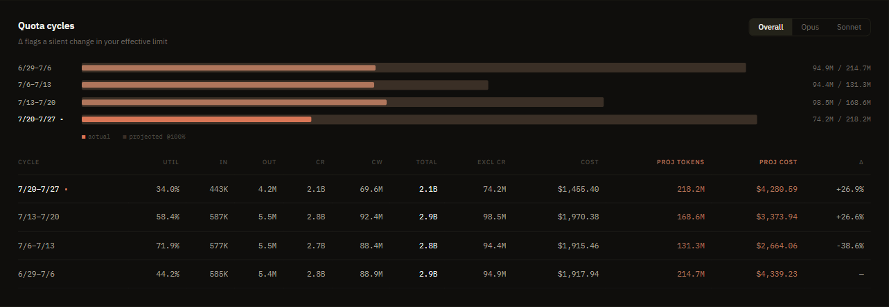
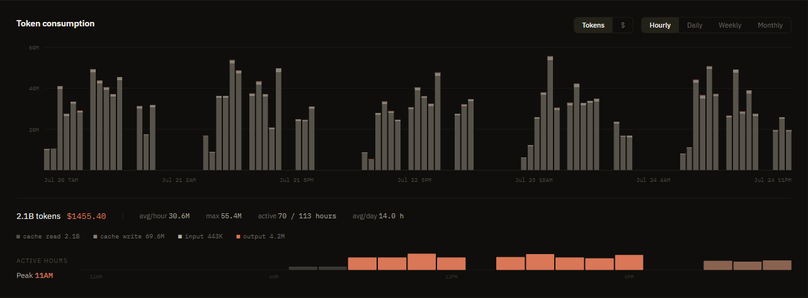
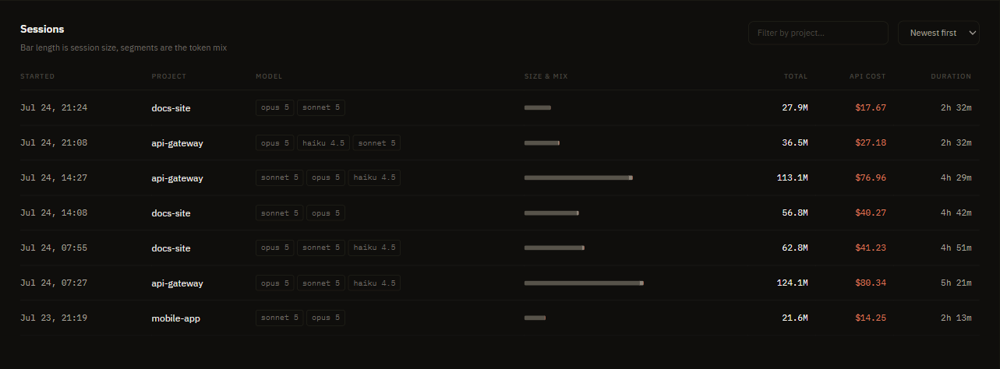

<div align="center">

<h1>Claude&nbsp;Usage&nbsp;Dashboard</h1>

<p><b>A flat fee tells you nothing about what you used.</b></p>

<p>
<a href="https://www.npmjs.com/package/claude-usage-dashboard"></a>
<a href="https://www.npmjs.com/package/claude-usage-dashboard"></a>


</p>

<p><code>npx claude-usage-dashboard</code></p>

<p>
<a href="#value">Value</a> ·
<a href="#cycles">Cycles</a> ·
<a href="#consumption">Consumption</a> ·
<a href="#sessions">Sessions</a> ·
<a href="#specification">Specification</a> ·
<a href="#install">Install</a>
</p>

</div>


<div align="center"><sub>Claude Code writes a log every time it works. This reads those logs and puts a number on them.</sub></div>

---

<h3 id="value">Value</h3>

<table>
<tr>
<td width="300" valign="top">

</td>
<td valign="top">

A subscription is a fixed number. What it buys is not.

One figure carries the rail: **API-equivalent value per subscription dollar**, at full quota utilization. A $200 plan routinely meters five figures of API-equivalent traffic in a month.

Above it, the windows you are actually rationed by — five-hour and seven-day — read from Anthropic with the OAuth credentials already sitting on your machine. Plan tier is detected, not declared.

Below, the crossing point: the share of the quota window at which the API bill would have overtaken the fee. It is only drawn when the selected range *is* that window; a 90-day cost and a 7-day utilization are not the same measurement, and the panel would rather say nothing than average them.

</td>
</tr>
</table>

---

<h3 id="cycles">Cycles</h3>

> Anthropic does not publish token limits, and limits move without announcement.



Every seven-day window is recorded as it closes — consumption by kind, and the ceiling implied at 100% utilization. Ten cycles retained, pooled across machines.

The `Δ` column carries the change from the window before. **When that number falls and your habits did not, you have the record.**

---

<h3 id="consumption">Consumption</h3>



Hourly through monthly. Tokens or dollars. Four bands in every bar, ordered by price: cache read, cache write, input, output.

Cache read is usually most of the mass and a tenth of the cost — the shape of that stack is the shape of your bill. Underneath, the hours you actually work, aggregated across the range.

---

<h3 id="sessions">Sessions</h3>



Bar length is session size; the segments are the token mix. Sortable by date, cost, or tokens, filterable by project. Exact counts on hover.

---

<h3 id="one-ledger">One ledger, every machine</h3>

A laptop, a desktop, a work machine. Each one only ever sees itself.

Point them all at a single shared folder — Drive, Dropbox, OneDrive, a NAS, an rsync target — and the logs roll into one view. No server, no account, no API key. A folder you already have.

---

<h3 id="specification">Specification</h3>

|  |  |
| :--- | :--- |
| **Reads** | `~/.claude/projects/**/*.jsonl` |
| **Quota** | Anthropic API · local OAuth credentials |
| **Refresh** | 5 s log re-read · 30 s dashboard · 30 s sync copy · 120 s quota |
| **Retained** | 10 quota cycles |
| **Granularity** | Hourly · daily · weekly · monthly |
| **Ranges** | Quota window · 7 / 30 / 90 days · custom |
| **Persists** | Range, granularity, plan, refresh — localStorage |
| **Typefaces** | Instrument Serif, IBM Plex Sans, IBM Plex Mono — bundled, not fetched |
| **Stack** | Node · Express · D3. No build step. |
| **Leaves the machine** | The quota read. Nothing else. |

<h3 id="design">Design</h3>

Near-monochrome and warm. A single accent — Claude's terracotta — spent only on the figure that matters and on anything past a threshold. Healthy meters stay neutral: colour is an alarm here, not decoration.

Instrument Serif for figures, IBM Plex Sans for the interface, IBM Plex Mono wherever you might compare one row against another. All three ship inside the package, so first render works offline and no request goes anywhere it was not promised. One page, no routes — the header anchors move you without reloading you.

---

<h2 id="install">Install</h2>

```bash
npx claude-usage-dashboard
```

Open **[localhost:3000](http://localhost:3000)**.

If that port is taken — or silently blocked, which Windows does more often than you would expect — it falls through 8080, then 8765, then whatever the OS hands out, and prints the address it actually got.

<details>
<summary><b>From source</b></summary>

```bash
git clone https://github.com/ludengz/claude-usage-dashboard.git
cd claude-usage-dashboard
npm install
npm start
```

</details>

<details>
<summary><b>A chosen port</b></summary>

```bash
PORT=8080 npx claude-usage-dashboard
```

Set explicitly, it does not fall back. It fails, and tells you why.

</details>

## Multi-machine sync

Two environment variables per machine, then start normally.

```bash
# ~/.bashrc, ~/.zshrc, etc.
export CLAUDE_DASH_SYNC_DIR="$HOME/Google Drive/claude-sync"
export CLAUDE_DASH_MACHINE_NAME="MacBook"   # optional — defaults to hostname
```

<details>
<summary><b>Windows, and inline</b></summary>

As user environment variables:

```powershell
[Environment]::SetEnvironmentVariable('CLAUDE_DASH_SYNC_DIR', 'C:\Users\you\Google Drive\claude-sync', 'User')
[Environment]::SetEnvironmentVariable('CLAUDE_DASH_MACHINE_NAME', 'Desktop', 'User')
```

Or inline, per run:

```bash
CLAUDE_DASH_SYNC_DIR="/path/to/shared" CLAUDE_DASH_MACHINE_NAME="MacBook" npx claude-usage-dashboard
```

</details>

Local logs are copied into `<sync_dir>/<machine_name>/` on startup and every 30 seconds thereafter. The dashboard then reads every machine folder in that directory. Any machine pointed at the same folder contributes to the aggregate.

Works with anything that syncs a folder: Google Drive, Dropbox, OneDrive, iCloud Drive, Syncthing, a NAS, a plain rsync cronjob.

## How it works

The data already exists. Claude Code writes JSONL session logs to `~/.claude/projects/` as it runs; this reads them, prices each record server-side, and aggregates on request. Logs are re-read every five seconds, and only files whose size or mtime changed are parsed again — new usage appears without a restart.

Quota comes from the Anthropic API, authenticated with the OAuth credentials the `claude` CLI already stored locally. That request is the only thing that leaves your machine.

## Tests

```bash
npm test
```

## License

ISC. Bundled typefaces are SIL Open Font License 1.1 — see [`public/fonts/OFL.txt`](public/fonts/OFL.txt).
